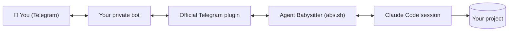

<div align="center">


### Remote-control and monitor Claude Code from Telegram

[](LICENSE)
[](https://github.com/Pranjalab/AgentBabysitter/stargazers)
[](abs.sh)
[](https://claude.com/claude-code)
[](docs/GUIDE.md)

</div>

Start a task, close the laptop, and let Claude keep coding. **Agent Babysitter**
messages your phone when work finishes, takes your reply straight back into the
**same live session**, and lets you send screenshots, use voice, and check your
usage — all from Telegram.

Claude Code already does the work. Agent Babysitter is the piece that lets you
walk away from it — a thin bash script wrapped around Anthropic's official
Telegram plugin. No daemon, no webhook, no second copy of your session.

<!-- Demo GIF goes here — the full loop: Claude working → Telegram "task done" → reply → Claude continues. -->

---

## ✨ Why you'll love it

- 🔔 **Leave your desk** — get pinged when Claude finishes or needs a decision.
- 📱 **Reply from your phone** — your message lands in the same live session.
- 🖼 **Send screenshots** — attach an image and Claude reads it directly.
- 🎤 **Voice both ways** — send a voice note, or ask for the answer spoken back.
- 📊 **Check usage remotely** — your Claude limits, one tap away, no browser.
- 🔒 **Your own private bot** — PIN-paired, so only you can reach it.
- 🖥 **Runs anywhere** — laptop, SSH, `tmux`, a headless Linux server.
- 🗂 **Multiple projects** — one bot per project, babysat side by side.

## 🚀 Quick start

```sh
# 1. Install
git clone https://github.com/Pranjalab/AgentBabysitter
cd AgentBabysitter
./install.sh

# 2. Launch Claude Code with Telegram wired in
abs
```

**About two minutes, once per bot:**

1. 🤖 **Create a bot** — message [@BotFather](https://t.me/BotFather), send
   `/newbot`, and paste the token back (it stays hidden and never leaves your
   machine).
2. 📲 **Pair your phone** — `abs` prints a short PIN; send it to your bot. That
   proves the phone is yours, and from then on the bot answers *only* you.
3. ✅ **Done** — Claude Code starts. Walk away; you'll get a message when a task
   finishes.

After setup it's just `abs`, from whatever project you're in. Setup is once per
bot, not once per project.

> **Prerequisites:** `claude`, `bun`, `jq`, `curl`. The installer checks for them
> and tells you what's missing rather than installing anything behind your back.

## 🧩 Features

### 🔔 Notifications — know when Claude needs you

A task finishing sends a short summary to your phone: what happened, and anything
that needs a decision. Stop babysitting the spinner; the spinner tells you when
it's done.

### 💬 Remote control — steer the same session from your phone

Reply in plain English and it arrives in the live session as if you'd typed it at
the desk. Approve a step, change direction, ask a question — the terminal and
Telegram are **one session**, not two conversations.

### 🖼 Screenshots — hand Claude an image without the terminal

Pasting an image into a terminal is awkward. Attach it in Telegram instead and
Claude reads it directly — a broken UI, a stack trace you photographed, a design
to match.

### 🎤 Voice — talk to Claude, and have it talk back

Send a voice note and it's transcribed; ask for the answer spoken and it replies
with a real voice message. Both run **locally** — no audio ever leaves your
machine.

<div align="center">

</div>

### 📊 Usage — check your Claude limits without leaving the chat

Tap `/usage` and your subscription limits and reset times come to Telegram — no
browser, no app, no breaking focus before a big task.

<div align="center">

</div>

### 🗂 Profiles — babysit several projects at once

Each project gets its own bot, so you can run more than one session in parallel
without them fighting over messages — `abs --profile work`.

### 🔒 Security — a private bot only you can reach

Pairing writes your Telegram ID to an allowlist; anyone else who finds the bot is
ignored before Claude ever sees the message. Full model in [SECURITY.md](SECURITY.md).

## 🤔 Why Agent Babysitter?

Claude Code *can* already talk to Telegram — Anthropic ships an official plugin
for it. But the bare plugin is just a pipe: it forwards messages and nothing
more. Agent Babysitter is the workflow around that pipe.

| | Official Telegram plugin, alone | With Agent Babysitter |
| --- | :---: | :---: |
| Chat with the session from Telegram | ✅ | ✅ |
| Guided bot setup & token validation | Manual | ✅ One command |
| Only you can reach the bot | Basic | ✅ PIN pairing + allowlist |
| "Task finished" reports to your phone | ❌ | ✅ |
| Check Claude usage from Telegram | ❌ | ✅ |
| Voice notes in and out, processed locally | ❌ | ✅ |
| Send screenshots Claude reads | Raw | ✅ Built in |
| Run multiple projects at once | ❌ Single bot | ✅ Profiles |
| Mute / hard-off controls | ❌ | ✅ |

It **complements** Claude Code — it doesn't replace or fork it. Your session,
your `CLAUDE.md`, and your permissions are all untouched.

## 🎯 Perfect for

- 🌙 **Overnight jobs** and long refactors you don't want to watch.
- 🛠 **Bug-fixing sessions** where you step away between turns.
- 🖥 **Remote servers** — run it over SSH on a VPS or home box and close the laptop.
- ☕ **Coffee breaks** and working from another room.
- 🗂 **Multi-project days** — a bot per project, all reporting to one phone.

## 💡 Why I built it

Three ordinary frustrations, all from using Claude Code every day:

1. **I was chained to my desk.** The moment I walked away I'd start worrying — is
   it waiting on me to approve something? Has it finished? Did it go the wrong way
   ten minutes ago while I was making coffee? So I just… sat there.
2. **I kept checking my usage.** Before a big task I'd open the browser *again* to
   see how much of my limit was left. Ten seconds, every time, breaking my focus.
3. **Handing Claude a screenshot was a pain.** Pasting into the terminal is
   awkward, and the image was usually on my phone anyway.

Agent Babysitter fixes all three — and it's stayed a single bash script the whole
way, because the point was to remove friction, not add a platform.

## ⌨️ Commands

```sh
abs                     # start a session (first run does setup)
abs --model opus        # any claude flag is passed straight through
```

| Command | What it does |
| --- | --- |
| 📋 `abs status` | What's paired, inbound state, whether it's live |
| 📊 `abs usage` | Your Claude limits — in the terminal and on Telegram |
| 🗂 `abs profiles` | List your bots and which are in use |
| 🔕 `abs quiet on` / `off` | Mute / unmute reports (inbound still works) |
| 🛑 `abs off` / `on` | Drop / re-enable all inbound Telegram |
| 🎤 `abs say "text"` | Speak it and send as a voice note |
| ♻️ `abs reset` | Remove this profile's token, allowlist, and state |
| ❓ `abs help` | The full list |

You can also just say it in chat — "mute the reports", "what's my usage" — and it
runs the same commands. For voice setup, profiles, servers, and troubleshooting,
see the **[full guide](docs/GUIDE.md)**.

## 🏗 Architecture

Telegram polls *outbound*, so nothing listens on a port and no webhook is needed —
which is why it works the same on a laptop, over SSH, or on a headless server.



Agent Babysitter validates your token, pairs your phone, injects the "report when
done" behavior per session, manages profiles, and reports usage. The plugin owns
the inbound polling; Claude Code does the work.

## 🔒 Security

**Only you can message your bot.** Pairing records your Telegram user ID in an
allowlist, and anyone else who finds the bot is ignored before Claude sees the
message. The PIN pairing proves the phone is yours; the bot token is kept out of
`ps` and stored owner-only.

It is **not a sandbox**, though — within your paired account, Claude has whatever
power Claude Code gives it on your machine. Read **[SECURITY.md](SECURITY.md)**
for the full model, including what it deliberately does *not* protect against.

## ❓ FAQ

**Does it expose my code?**
No. It's your own private bot, and only your paired account can reach it. One
honest caveat: Telegram itself sees the messages (they're not end-to-end
encrypted), so don't use it for work where that matters.

**Can anyone else message my bot?**
No. Unpaired accounts are dropped before Claude ever sees them.

**Does voice processing stay local?**
Yes. Transcription and speech both run on your machine — no cloud speech vendor is
involved. (The audio still travels over Telegram, like any message.)

**Can I run multiple projects?**
Yes — one bot per project, via [profiles](docs/GUIDE.md#profiles--more-than-one-session-at-once).

**Does it work over SSH / on a server?**
Yes. Telegram polls outbound, so no public IP, open port, or webhook is needed.
Run it in `tmux` and close the laptop.

**Does it require a server?**
No. It runs anywhere Claude Code runs — a server is just one option.

**Can I stop Claude remotely?**
Not yet. Messages are read between turns, so you can steer the next step but not
interrupt the current one.

**Which platforms are supported?**
Built and tested on Linux. It should run anywhere with `bash`; macOS may need GNU
coreutils (`readlink -f` and `date -d` are used). Contributions welcome.

## 🙏 Acknowledgements

Agent Babysitter stands on two things it doesn't reinvent:

- **[Claude Code](https://claude.com/claude-code)** — the AI coding agent doing
  the actual work.
- **Anthropic's official Telegram plugin** (`telegram@claude-plugins-official`) —
  it owns the inbound polling and the `download_attachment` / `reply` tools this
  builds on.

## 🤝 Contributing

Issues, ideas, and pull requests are all welcome — bug reports and "it broke on my
setup" notes especially. Open one at
[github.com/Pranjalab/AgentBabysitter/issues](https://github.com/Pranjalab/AgentBabysitter/issues).

If Agent Babysitter saves you from waiting around for Claude Code, a ⭐ genuinely
helps other developers find it.

## 📄 License

MIT — see [LICENSE](LICENSE). Do what you like with it.
